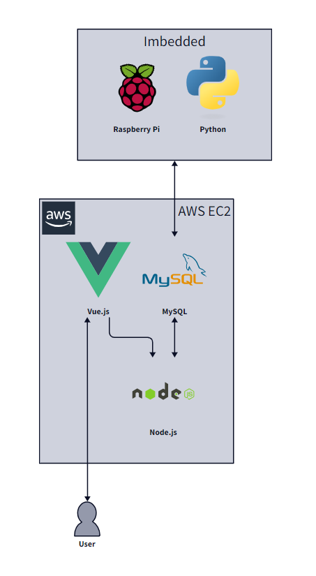

# LnF-Project

RC카를 활용한 분실물 센터(**Lost and Found**) 관리 서비스 프로젝트

## System Architecture

## Tech Stack

### BackEnd

|                                       Node.js                                       |
| :---------------------------------------------------------------------------------: |
|  |

### FrontEnd

|                                       Vue.js                                       |
| :--------------------------------------------------------------------------------: |
|  |

### Database

|                                        MySQL                                        |                                                          AWS                                                          |
| :---------------------------------------------------------------------------------: | :-------------------------------------------------------------------------------------------------------------------: |
|  |  |

### Imbedded

|                                         Raspberry Pi                                         |                                        Python                                        |
| :------------------------------------------------------------------------------------------: | :----------------------------------------------------------------------------------: |
|  |  |

### CI/CD

|                                       Nginx                                       |
| :---------------------------------------------------------------------------------: |
|  |

## Web API

### 분실물 등록, 조회, 수정, 삭제

- **GET** `/api/list`: 분실물 전체 조회

  - **GET** `/api/list/:id`: 분실물 일부 조회

- **POST** `/api/list`: 분실물 등록

- **PATCH** `/api/list/:id`: 분실물 수정

- **POST** `/api/list/:id/image`: 분실물 이미지 수정

- **DELETE** `/api/list/:id`: 분실물 삭제

### 분실물 찾으러 가기, 수령 완료

- **POST** `/find`: 분실물 찾으러 가는 명령어 DB에 업로드

- **POST** `/complete`: 수령 완료 api

### 분실물 등록 및 수령 내역 조회

- **GET** `/api/history`: 분실물 등록 및 수령 내역 전체 조회

### TODO

- 모바일 버전 하단바 구현
